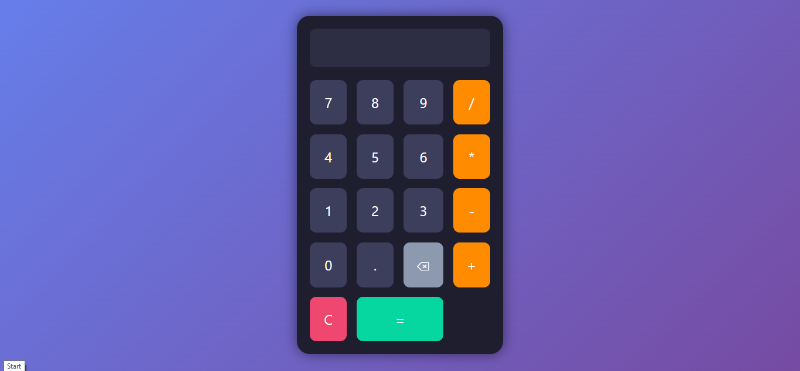

# 🔢 Calculator Web App with Local Storage

This is a fully functional web-based calculator built using **HTML, CSS, and JavaScript**.  
It performs standard arithmetic operations and uses **Local Storage** to save the **last calculated result**, even after page reload.

## 🚀 Features

- Basic arithmetic operations: Addition, Subtraction, Multiplication, Division
- Real-time input display
- Clean and responsive UI
- **Local Storage Integration**:
  - Last calculated result is saved
  - Automatically shows saved result on next visit

## 🧠 Technologies Used

- HTML5
- CSS3 (Responsive design)
- JavaScript (DOM manipulation, localStorage)

## 💾 How Local Storage Works

- After every valid calculation, the result is saved to `localStorage`.
- When the page reloads, the calculator checks for existing saved result and displays it.

## 📸 App Screenshot

